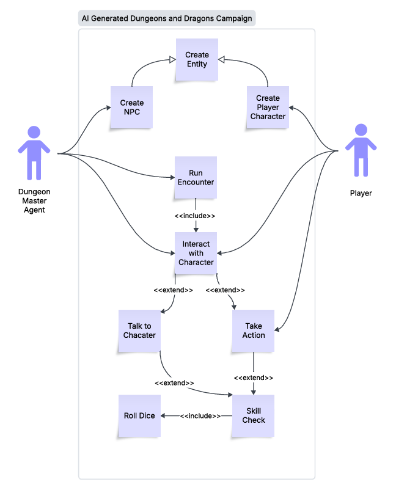

# One Feature from the Project Use Case Diagram Completed

Feature Completed: tools for creating characters including players and NPCs

Diagram Cases: create entity, create NPC, create player character

Associated Commits:
1. 23692466d77e55b27de908ed529fa942ac60059e
  - add character creation tools
    - https://github.com/Jamnomics/Frantz_441/commit/23692466d77e55b27de908ed529fa942ac60059e
  - tools/create_character.py
    - create character function
  - tools/create_npc.py
    - npc schema
    - run function
  - tools/create_player.py
    - player schema
    - run function
  - tools/init.py
    - list tool schemas and functions
  - util/templates/dm_chat.json
    - user prompt to create character
2. 41e64b83219ce83d6ef94b9f1400bce866854987
  - store chars in format that can later use rag
    - https://github.com/Jamnomics/Frantz_441/commit/41e64b83219ce83d6ef94b9f1400bce866854987
  - data/characters/players/json/chip.json
    - player description in JSON
  - data/characters/players/rag/chip.txt
    - player description in natural language
  - tools/character_store.py
    - save character function
    - build rag summary function
    - load all characters function
    - load character function
  - tools/create_npc.py
    - save when creating character
  - tools/create_player.py
    - notify of missing required fields
    - save when creating character
  - tools/tool_runner.py
    - block tool calls with placeholder values
3. 3c68b63dacabbe2647265150b08db9fa5a172557
  - add prompt variables based on existence of player
    - https://github.com/Jamnomics/Frantz_441/commit/3c68b63dacabbe2647265150b08db9fa5a172557
  - agent.py
    - add prompt variables based on player existence
  - data/characters/npcs/json/gorin_the_gruff.json
    - NPC description in JSON
  - data/characters/npcs/rag/gorin_the_gruff.txt
    - NPC description in natural language
  - util/templates/dm_chat.json
    - add prompt variables based on player existence

# Use Case Diagram

# Player Character Does Not Exist

PS C:\Users\Jamie\Desktop\Frantz_441> & c:\python313\python.exe c:/Users/Jamie/Desktop/Frantz_441/agent.py

[Tool call: create_player({'name': '', 'backstory': '', 'char_class': '', 'hp': 0, 'level': 0})]
[Tool result: Tool create_player called with placeholder values for ['name', 'backstory', 'char_class']. Ask the user for these details before calling the tool.]
Agent: The thrill of adventure awaits! Let's begin by creating your player character.

To get started, I need to know a bit more about you. Please provide me with the following details:

1. **Name**: What is your character's name? (e.g., Eilif Stonefist, Elara Moonwhisper, etc.)
2. **Class**: What type of adventurer would you like to play as? Choose from:
        * Barbarian
        * Bard
        * Cleric
        * Druid
        * Fighter
        * Monk
        * Paladin
        * Ranger
        * Rogue
        * Sorcerer
        * Warlock
        * Wizard
3. **Backstory**: What drove your character to become an adventurer? (e.g., a noble quest, a personal tragedy, or a desire for fortune and fame)

Once I have this information, I'll create your player character and we can begin our epic campaign!
You: name is Chip, class is rogue, backstory is orphan looking for parents

[Tool call: create_player({'backstory': 'orphan looking for parents', 'char_class': 'rogue', 'name': 'Chip', 'race': ''})]
[Tool result: Tool create_player called with placeholder values for ['race']. Ask the user for these details before calling the tool.]
Agent: With your character's basics settled, let's add a bit more depth to Chip, the rogue.

To complete the creation of your player character, I need to know one more thing:

1. **Race**: What ethnic background does Chip have? This will influence their abilities and cultural connections. Choose from:
        * Human
        * Dwarf
        * Elf
        * Halfling
        * Gnome
        * Half-Elf
        * Half-Orc

Please respond with the name of your character's race.

(Note: As a rogue, Chip is likely to be small and agile, so I'll assume a halfling or human for this background. If you'd like something else, feel free to let me know!)
You: human

[Tool call: create_player({'race': 'human', 'backstory': 'orphan looking for parents', 'char_class': 'rogue', 'name': 'Chip'})]
[Saved chip to c:\Users\Jamie\Desktop\Frantz_441\data\characters\players\json and c:\Users\Jamie\Desktop\Frantz_441\data\characters\players\rag]
[Tool result: {'name': 'Chip', 'race': 'human', 'class': 'rogue', 'level': 1, 'hp': 10, 'max_hp': 10, 'inventory': [], 'status': 'alive', 'backstory': 'orphan looking for parents', 'type': 'player', 'gold': 10}]
Agent: Welcome to the land of Eldoria, a realm of wonder and adventure! You are Chip, a human rogue with a mysterious past. Your quest is to find your long-lost parents, who vanished when you were just a child.

As we begin our campaign, you find yourself in the bustling city of Willowhaven, a hub of commerce and intrigue. The city is divided into four quarters: the nobles' district, the merchant's quarter, the artisans' quarter, and the seedy underbelly of the thieves' quarter.

You've heard rumors of a wealthy patron who might be able to help you find your parents. This patron is said to reside in the grand mansion on the hill, overlooking the city. However, the mansion is heavily guarded by skilled warriors and enchanted wards.

As you make your way through the crowded streets, you notice several shops and establishments that catch your eye:

1. **The Red Griffin Inn**: a popular gathering spot for travelers and locals alike.
2. **Marius' Enchanted Equipment**: a shop selling magical goods and rare artifacts.
3. **Lady Harcourt's Fashion Boutique**: a stylish establishment offering the latest fashions from across the realm.

Which location would you like to visit first, Chip?
You: 

# Player Character Does Exist

PS C:\Users\Jamie\Desktop\Frantz_441> & c:\python313\python.exe c:/Users/Jamie/Desktop/Frantz_441/agent.py

[Tool call: create_npc({'role': 'village guard', 'disposition': 'friendly', 'name': 'Gorin the Gruff', 'race': 'dwarf', 'char_class': 'guard'})]
[Saved gorin_the_gruff to c:\Users\Jamie\Desktop\Frantz_441\data\characters\npcs\json and c:\Users\Jamie\Desktop\Frantz_441\data\characters\npcs\rag]
[Tool result: {'name': 'Gorin the Gruff', 'race': 'dwarf', 'class': 'guard', 'level': 1, 'hp': 10, 'max_hp': 10, 'inventory': [], 'status': 'alive', 'role': 'village guard', 'disposition': 'friendly', 'type': 'npc'}]
Agent: Welcome back, Chip the Rogue! You find yourself in the small village of Oakwood, nestled at the edge of a dense forest. The villagers are friendly and welcoming, but there's a sense of unease in the air. Recently, strange occurrences have been happening in the village: tools gone missing, food stores tampered with, and eerie noises heard in the dead of night.

You're standing outside the local tavern, the Red Griffin Inn, where Gorin the Gruff, the village guard, has just approached you. "Ah, Chip the Rogue! I've been expecting you," he says with a hearty grin. "We've had some... issues here in Oakwood. I think it's time someone with your skills helped us get to the bottom of things."

Gorin hands you a rough map of the village and points out several locations where the strange occurrences have happened. "I've marked the areas where we've found signs of tampering or suspicious activity. Be careful, Chip. We don't know what we're dealing with here."

You look at the map and notice three locations that catch your attention:

1. The local blacksmith's forge, where tools have gone missing.
2. The village bakery, where food stores have been tampered with.
3. The old windmill on the outskirts of the forest, where eerie noises have been heard.

What would you like to do first, Chip?
You: